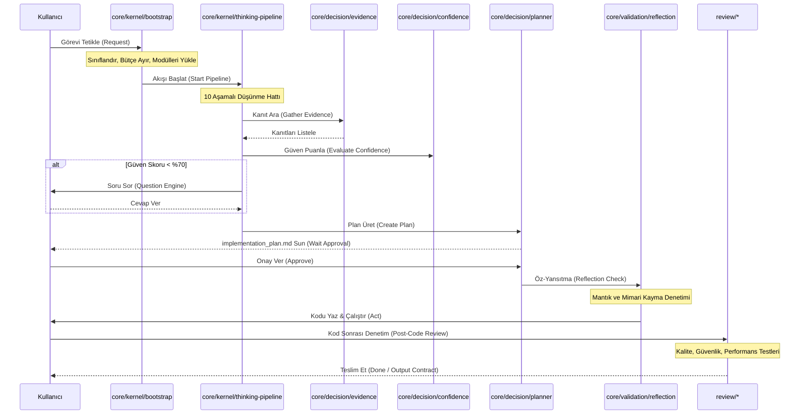

# Etkileşim ve Bağımlılık Modeli (core/kernel/interaction-model.md)

---

## 1. Amaç (Purpose)
Decision Runtime modüllerinin çalıştırma sırasını (Execution Order), veri akış yönlerini ve birbirleriyle olan iletişim sözleşmelerini (Contracts) tanımlamak.

---

## 2. Çalışma Sırası ve İş Akışı (Execution Order)

Ajan çalışma zamanı tetiklendiğinde işlemler sırasıyla aşağıdaki gibi akar:

---

## 3. Modüller Arası Sözleşmeler (Contracts)

### A. Bootstrap -> Thinking Pipeline Sözleşmesi
*   *Girdi*: `TaskType` (Feature/Bug/Refactor) + `ContextBudgetLimits` (Max dosya: 5).
*   *Çıktı Kriteri*: Pipeline, belirtilen dosya limitlerini aşmadan aramaları sonlandırmalıdır.

### B. Evidence -> Confidence Sözleşmesi
*   *Girdi*: Kanıt Türleri ve Dosya Yolları.
*   *Çıktı Kriteri*: Güven motoru, toplanan her kanıta uygun ağırlığı (1.0 veya 0.6) atayarak formülü işletmelidir.

### C. Planner -> Reflection Sözleşmesi
*   *Girdi*: Onaylanmış `implementation_plan.md` dosyası.
*   *Çıktı Kriteri*: Reflection motoru, plandaki her bir dosyayı kodlama öncesinde mimari açıdan doğrulamalıdır.

### D. Act (Developer) -> Reviewer Sözleşmesi
*   *Girdi*: Yazılan kaynak kodlar ve eklenen birim testler.
*   *Çıktı Kriteri*: Reviewer, kod standartları ve test başarı oranı (%100) kriterlerini denetlemelidir.
