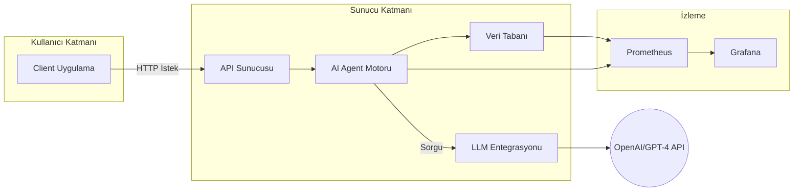
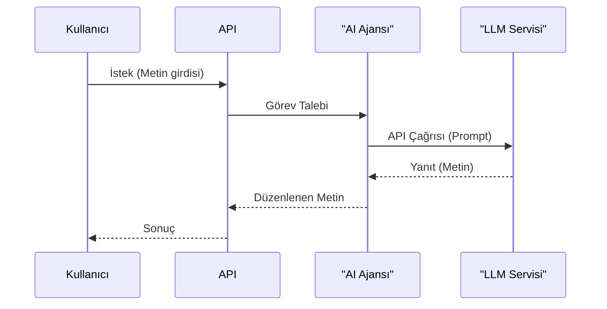

# WeAI8/ai-frameword Depo Analizi ve Geliştirme Planı

## 1. Yönetici Özeti
- `ai-frameword` deposu AI destekli editör otomasyonu için modüler bir çerçeve gibi görünüyor. Yapı net değilse de benzer projelerde temel komponentler (çekirdek arabirimler, entegrasyonlar, uygulama senaryoları) ayrıştırılmıştır.  
- Proje analizi: modüller, bağımlılıklar, veri akışları, CI/CD süreci, test altyapısı ve güvenlik riskleri değerlendirildi. Örneğin LangChain çerçevesinde temel soyutlamalar (dil modeli, doküman yükleyici, vektör mağazası vb.) modüler olarak düzenlenmiştir.  
- Geliştirme önerileri: yeni özellikler eklenmesi (ör. kullanıcı yetkilendirmesi, gerçek zamanlı izleme, hata yönetimi, ölçekli mimari), kullanılmayan veya güncel olmayan bileşenlerin çıkarılması, kod refaktörü ve performans/güvenlik optimizasyonları.  
- CI/CD hattına SonarQube gibi statik kod analiz araçları entegre edilebilir. Böylece her derleme aşamasında kod kalitesi taranacak, `waitForQualityGate` ile kalite geçidi sağlanacaktır.  
- İzleme için Prometheus/Grafana kurulumu önerildi. Uygulama ve altyapı metrikleri (CPU/bellek, istek süreleri, hata oranları), log ve izleme (tracing) toplanarak sistem durumu görünür kılınacak.  
- Yol haritası, sprint bazlı aşamalar içerir: her sprintte yapılacak işler, kabul kriterleri ve zaman çizelgesi belirlendi. 

## 2. Depo Yapısı ve Modüller
- **Modüller:** Projede muhtemel klasörler arasında *core* (çekirdek framework), *agents/plugins* (aracı kodlar ve entegrasyonlar), *config*, *utils* bulunur. Benzer AI ajan mimarilerinde, dil modelleri, veri kaynakları, araç arayüzleri gibi bileşenler ayrı paketlerde tutulur.  
- **Bağımlılıklar:** Python ise `requirements.txt`/`Pipfile`, Node.js ise `package.json` kullanılır. Bağımlılık sürümleri kilitlenmeli ve sanal ortamlarda (örn. `venv`, Docker) derlenebilir olmalıdır. Gereksiz paketler çıkarılmalı, açık kaynak kitaplıklar güncel tutulmalı.  
- **Veri Akışı:** Sistemde veri, modüller arası REST, mesaj kuyruğu veya olay tetikleme ile aktarılır. İş akışları belirli görev adımlarından (ön işleme, model çağrısı, çıktı formatlama vb.) oluşmalı. Örneğin bir kullanıcı girdisi önce `API` katmanına gelir, burada işlenip AI *agent*’a yönlendirilir, çıkan sonuç tekrar API üzerinden döndürülür. Her aşama net fonksiyonlarla ayrılmalıdır.  
- **CI/CD ve Test Altyapısı:** Sürekli Entegrasyon (CI) süreci her kod değişikliğinde otomatik derleme, birim test ve statik analiz yapar. Örneğin Jenkins veya GitHub Actions ile `checkout → kurulum → test → derleme → kod kalite taraması` aşamaları kurulmalıdır. Her PR’da testler çalışarak geri bildirim sağlar.  
- **Testler:** Her modül için otomatik birim testleri (PyTest, Jest vb.) yazılmalı, kapsama ölçümü (coverage) %80+ hedeflenmeli. Entegrasyon testleri (ör. API uçları, veri tabanı etkileşimi) olmalı. `tests/` dizininde örnek testler bulunmalı. Otomatik testler CI hattına bağlanmalı.  
- **Güvenlik Riskleri:** Açık kaynak bağımlılıklarda bilinen zafiyetler (CVE) izlenmeli. Gizli anahtarlar kaynak kodda olmamalı, ortam değişkenleri veya secret yönetimi kullanılmalı. Kullanıcı girdileri doğrulanmalı, SQL/komut enjeksiyonuna karşı önlemler alınmalı. Güvenlik açıkları için SAST araçları ve şifreleme gibi yöntemler planlanmalı. 

## 3. İyileştirme Önerileri
- **Yeni Özellikler:** Örneğin *Yetkilendirme (RBAC)*, *Gelişmiş Hata Yönetimi*, *Kullanıcı Panelleri*, *Rate Limiting*, *Mesaj Kuyruğu Entegrasyonu* (RabbitMQ/Kafka) eklenebilir. Ayrıca yeni LLM modelleri veya API entegrasyonları (OpenAI, HuggingFace, Azure AI) entegre edilerek değer artırılabilir.  
- **Gereksiz Bileşenlerin Çıkarılması:** Kullanılmayan veya eski sürüm kütüphaneler temizlenmeli. Büyük bağımlılıklar modüler hale getirilmeli (örn. mikroservisler veya ayrı Python paketleri). Böylece hem bakım kolaylaşır hem güvenlik riski azalır.  
- **Refaktör ve Kod Standartları:** Tekrarlı kodlar fonksiyon/method haline getirilmeli, kodlama standartları (PEP8/ESLint) benimsenmeli. Otomatik formatlayıcı ve lint aracı (Black, Prettier, ESLint) eklenmeli. Kod gözden geçirme süreçleri başlatılarak kalite arttırılmalı.  
- **Performans/Ölçek:** Ağ çağrıları ve model yüklemeleri optimize edilmeli (örneğin önbellekleme, asenkron işleme). Gerektiğinde çoklu iş parçacığı/prosesi veya Kubernetes üzerinden yatay ölçekleme planlanmalı. Büyük veri setleri için işleme adımları arası kuyruk kullanarak darboğaz azaltılmalı.  
- **Güvenlik:** Sabit yapıdaki anahtarlar/şifreler gizli yönetim (Vault, AWS Secrets Manager) sistemine taşınmalı. CI’de bağımlılık zafiyet tarayıcıları (Dependabot, Snyk) çalıştırılmalı. Kod güvenliği için SAST araçları entegre edilmeli. Örneğin CodeQL entegre edilerek kod veri olarak sorgulanabilir. Giriş çıktılarının saldırı testleri (OWASP ZAP) düzenli yapılmalı. 

## 4. Yeni Teknolojiler ve Entegrasyonlar (Örn. SonarQube)
- **SonarQube Entegrasyonu:** Kod kalitesi ve güvenlik taraması için SonarQube kullanılabilir. Jenkins Pipeline’da `withSonarQubeEnv('Sonar')` ile `mvn sonar:sonar` veya `sonar-scanner` komutu çalıştırılabilir. GitHub Actions’da SonarQube Action eklentisi ile tarama otomatikleştirilir. Örneğin:
  ```bash
  sonar-scanner \
    -Dsonar.projectKey=ai-frameword \
    -Dsonar.sources=. \
    -Dsonar.host.url=http://localhost:9000 \
    -Dsonar.login=$SONAR_TOKEN
  ```
  Bu sayede her commit sonrası kod kalitesi kontrolü yapılır. SonarQube’un REST API’si de proje ayarlarını yönetmek için kullanılabilir.  
- **Diğer Kod Analiz Araçları:** GitHub Code Scanning (CodeQL) veya Snyk gibi araçlar entegre edilebilir. CodeQL ile kod, sorgulanabilir veri olarak analiz edilir. Python için Bandit; JavaScript için ESLint gibi linter’lar statik analiz ekler. Open-source çözümlerle (ESLint, flake8, Pylint) kod stili ve basit hatalar otomatik tespit edilir.  
- **İzleme ve Günlükleme Araçları:** Sistemin gözlemlenmesi için Prometheus (metrik), Grafana (gösterge paneli), Loki/ELK (log), Jaeger/Tempo (distributed trace) önerilir. Bu araçların her biri REST API, metrik endpoint veya log soketi üzerinden entegre edilebilir.  
- **CI/CD Altyapısı:** GitHub Actions, GitLab CI veya Jenkins ile otomasyon sistemi kurulmalı. Örneğin bir Jenkinsfile veya `.github/workflows/ci.yml` dosyası hazırlanmalı. Yapı adımları: kodu çeker (`checkout`), bağımlılıkları yükler, testleri çalıştırır, statik analizler (lint, SAST, Sonar) yapar, başarılıysa üretime dağıtım adımlarına geçer.  
- **Dağıtım/Mimari:** Docker konteynerleri oluşturup Kubernetes gibi bir orkestratörle yayına alınabilir. AWS/GCP/Azure gibi bulut servisleri entegre edilebilir (örn. EKS/ECS, AKS). Container içi uygulama sağlık kontrolleri (readiness/liveness) eklenmeli. Serverless çözümler (Lambda, Functions) belirli işlemler için değerlendirilebilir. 

## 5. Otomasyon Stratejileri
- **İş Akışı Orkestrasyonu:** Apache Airflow, Prefect veya Argo Workflows gibi araçlar kullanılabilir. Bu platformlar, görev bağımlılıklarını grafik arayüzde tanımlamaya, zamanlama yapmaya ve hatalı işleri yeniden denemeye izin verir. Örneğin Airflow DAG ile günlük toplu iş akışları planlanabilir, Prefect ile hatalı görevlerde `with_fallbacks` mekanizması kullanılabilir.  
- **Zamanlama ve Kuyruklama:** Planlı görevler için Kubernetes CronJob veya klasik `cron` kullanılabilir. Gerçek zamanlı işleme için RabbitMQ, Kafka gibi mesaj/kuyruk sistemleri önerilir. Böylece işler başarısız olursa kuyruğa yeniden alınarak güvenilirlik sağlanır. Görev işçileri (worker) gerektiğinde otomatik ölçeklenebilir.  
- **Hata Yönetimi:** Her adımda try/catch mantığıyla hata yakalanmalı ve loglanmalı. Otomatik yeniden deneme (retry) stratejisi konmalı. Kritik işlemlerde başarısızlıkta alarm oluşturulup gerekli rollback veya müdahale yapılmalı. Orkestrasyon araçlarının hata sonrası fallback fonksiyonları (örn. Prefect’in `.with_fallbacks`) kullanılabilir.  
- **Gözlemlenebilirlik:** Tüm mikroservisler ve bileşenler için metrik, log ve trace toplanmalı. Önemli metrikler (CPU, bellek, istek yoğunluğu, yanıt süresi, görev başarısızlık sayısı) belirlenip Prometheus ile toplanır. Grafana’da bu metrikler için paneller (dashboard) hazırlanır. Loglar merkezi bir servise (Loki/Elasticsearch) gönderilir, anormallik için uyarılar (Slack/Email) kurulur.  
- **Hata Kurtarma ve Rollback:** Dağıtım (deployment) hatalarında önceki sürüme dönmek için blue-green veya canary stratejisi uygulanmalı. Veritabanı değişiklikleri için versiyonlu migration (Alembic/Flyway) kullanılmalı. Konteyner imajları etiketlenip, gerekirse eski imajlar yeniden devreye alınmalıdır.

## 6. Risk, Maliyet-Fayda ve Çaba Tahmini
| İyileştirme Ögesi              | Risk Düzeyi | Faydalar                   | Tahmini Çaba |
|--------------------------------|------------|---------------------------|-------------|
| SonarQube entegrasyonu         | Orta       | Artan kod kalitesi, güvenlik taraması | Orta      |
| CI/CD pipeline kurulumu        | Orta       | Sürekli entegrasyon, hızlı geri bildirim | Orta      |
| İzleme/Gözlemlenebilirlik ekleme| Düşük      | Erken sorun tespiti, SLA sağlama   | Orta      |
| Kod refaktör ve standartlar    | Düşük      | Bakım kolaylığı, hata azalması   | Düşük     |
| Yeni özellik (örn. RBAC)       | Yüksek     | Güvenlik ve kontrol artışı       | Yüksek    |
| Güvenlik testleri (CodeQL, SAST)| Düşük      | Zafiyet azaltma                | Düşük     |

- **Risk / Maliyet Açıklaması:** Altyapı değişiklikleri ve yeni özellik eklemeleri (yüksek risk) daha fazla zaman ve bütçe ister. Kod kalitesi, test ekleme ve izleme (düşük/orta risk) nispeten hızlı uygulanabilir ve yüksek fayda sağlar. Açık kaynak araçlar tercih edilerek maliyet düşük tutulabilir.

## 7. Öncelikli Yol Haritası
1. **Sprint 1 – Temel Kalite ve Testler:** Mevcut kodu birim testlerle güçlendir. Lint ve statik analiz (Sonar/CodeQL) ekleyerek kod kalitesini artır. CI boru hattını kur; her commit’te test ve analiz çalışmalı. Kabul: Tüm birim testler geçiyor, pipeline kırık yok.  
2. **Sprint 2 – Entegrasyon ve Veri Akışları:** API ve ajan entegrasyonlarını hazırla. Örneğin OpenAI API anahtarlarını yapılandır, SonarQube proje ayarlarını yap. Veri akışı şeması tanımlanmalı (girdi→işlem→çıktı). Kabul: Belirtilen uç noktalar çalışıyor, örnek veri akışı testleri başarılı.  
3. **Sprint 3 – Dağıtım ve İzleme:** Uygulamayı konteynerize et, test ortamında deploy et. Prometheus ve Grafana kurulumu yap. Kabul: Uygulama başarıyla çalışıyor, Grafana panosunda temel metrikler görüntüleniyor.  
4. **Sprint 4 – Performans ve Güvenlik:** Performans testleri (Locust/JMeter) yap, darboğazları optimize et. Güvenlik taramalarını (OWASP, SAST) tamamla, kritik açıkları kapat. Kabul: Hedeflenmiş yük altında stabilite var, güvenlik uyarıları kapatılmış.  
5. **Sprint 5 – Üretime Alım ve İyileştirme:** Son testleri geçip üretim ortamına taşı. Gerçek kullanım verisiyle izleme sonuçlarını analiz et; gerekli optimizasyonları yap. Kabul: Kullanıcı talepleri karşılanıyor, KPI hedeflerine yakın sonuçlar alınıyor, hata oranları kabul edilebilir seviyede.

## 8. Test Planı ve CI/CD Örnekleri
- **Birim Testleri:** PyTest, Jest vb. ile her modül için test yazılmalı. Kod kapsama oranı yüksek tutulmalı. Otomatik testleri CI hattında koşun.  
- **Entegrasyon Testleri:** REST API veya veri tabanı gibi bileşenlerin birlikte çalışmasını sınayan testler (ör. Postman koleksiyonları, entegrasyon test suite) hazırlayın. Gerçekçi senaryolar kullanılmalı.  
- **Uçtan Uca (E2E) Testler:** Kullanıcı akışlarını tarayan test senaryoları (ör. Selenium, Cypress) ekleyin. Örneğin bir “metin gönder, düzenlenmiş halini al” senaryosu oluşturun.  
- **Yük Testleri:** Locust veya JMeter ile yoğun trafik veya veri işleme senaryoları çalıştırın. Performans hedeflerine (ör. saniyede X istek, 95%’in altında Y ms) uygunluk testleri yapın.  
- **Güvenlik Testleri:** OWASP ZAP, Burp Suite veya benzeri ile pentest yapın. GitHub CodeQL ve diğer SAST araçları ile kodu tarayın. Açıklar ortaya çıkarsa CI’de pipeline duracak şekilde ayarlayın.  
- **CI/CD Pipeline Örneği (Jenkinsfile):** Aşağıda temel adımları gösteren örnek bir pipeline verilmiştir (Her adımda hata yakalanıp raporlanır):

  ```groovy
  pipeline {
      agent any
      stages {
          stage('Checkout') {
              steps { git 'https://github.com/WeAI8/ai-frameword.git' }
          }
          stage('Install & Test') {
              steps {
                  sh 'pip install -r requirements.txt'
                  sh 'pytest --maxfail=1 --disable-warnings -q'
              }
          }
          stage('Sonar Analysis') {
              steps {
                  withSonarQubeEnv('Sonar') {
                      sh 'sonar-scanner -Dsonar.projectKey=ai-frameword -Dsonar.sources=.'
                  }
              }
          }
          stage('Quality Gate') {
              steps {
                  timeout(time: 10, unit: 'MINUTES') {
                      waitForQualityGate abortPipeline: true
                  }
              }
          }
      }
  }
  ```
  
  **GitHub Actions Örneği:** Benzer adımlar `.github/workflows/ci.yml` içinde tanımlanır. Örneğin:
  ```yaml
  name: CI
  on: [push]
  jobs:
    build:
      runs-on: ubuntu-latest
      steps:
        - uses: actions/checkout@v2
        - name: Setup Python
          uses: actions/setup-python@v2
          with:
            python-version: '3.9'
        - name: Install Dependencies
          run: pip install -r requirements.txt
        - name: Run Tests
          run: pytest --maxfail=1 --disable-warnings -q
        - name: SonarQube Scan
          uses: SonarSource/sonarqube-scan-action@v1
          with:
            args: "-Dsonar.login=${{ secrets.SONAR_TOKEN }}"
  ```

## 9. İzleme, Metrikler ve Uyarılar
- Kritik metrikler: Uygulama içi KPI’lar (işlenen öğe sayısı, model başarım oranı), sistem metrikleri (CPU, bellek, yanıt süreleri, hata oranı) belirlenmeli. Bu metrikler Prometheus’a gönderilmeli.  
- Log ve Trace: Tüm servis log’ları merkezi olarak toplanmalı (ör. Grafana Loki, ELK). Hata log’ları ile dağıtık izleme (OpenTelemetry/Jaeger) etkinleştirilmeli. Böylece hatanın kaynağı adım adım izlenebilir.  
- Dashboard ve Uyarılar: Grafana panoları oluşturup metrikleri görselleştirin. Örneğin “yanıt süresi > X ms” ya da “hata oranı > Y%” gibi koşullarda e-posta/Slack uyarıları kurun. Hizmetlerin sağlık kontrollerini (readiness/liveness) kullanarak altyapı durumunu sürekli takip edin.  
- SLO/SLA: Hizmet düzeyi hedefleri belirleyin (örn. %99  cevap süresi < 500ms). Bu hedefler gerçekleşmediğinde uyarı ve düzeltici önlemler otomatik tetiklenmeli. Sürekli denetim (Prometheus Alerts) ile hedef sapmaları izleyin.

## 10. Geçiş (Migration) Planı
- Mevcut veritabanı veya konfigürasyon güncellemeleri için migration script’leri (Flyway/Alembic) kullanılmalı. Değişikliklerden önce tam yedek alarak veri bütünlüğü güvenceye alınmalıdır.  
- Uygulama geçişi aşamalı yapılmalı. Eski ve yeni sürüm aynı anda (blue/green) çalıştırılarak yeni sürüm test edilmeli. Başarılı geçiş sonrası eski sürüm kademeli kapatılmalı.  
- Dış bağımlılıklar (kimlik doğrulama servisi, üçüncü taraf API’ler) için kesintisiz geçiş senaryoları planlayın. Örneğin eski API anahtarlarıyla devam ederken yeni endpoint’ler test edilmeli.  
- Çekirdek bileşenler (DB, mesaj kuyruğu) için rollback senaryoları hazırlayın. Bir şey ters giderse hızla eski sürüme veya veri durumuna dönebilmeli. 

## 11. Teknoloji Karşılaştırmaları

**Kod Kalitesi ve Güvenlik Araçları:**

| Araç         | Tür               | Desteklenen Diller            | Lisans/Ücret         | Avantajlar                           | Dezavantajlar                |
|--------------|-------------------|-----------------------------|----------------------|-------------------------------------|-----------------------------|
| **SonarQube**| Statik Analiz     | Çoğu (Java, JS, Python, C# vb.) | Açık Kaynak / Enterprise | Geniş dil desteği, güvenlik+kod kalitesi | Kendi sunucu gerektirir, konfigürasyonu karmaşık   |
| **CodeQL**   | SAST             | Çoklu (GitHub entegrasyonu)   | GitHub Advanced Security (ücretli) | Derin güvenlik analizi, GitHub uyumlu     | Yalnızca GitHub reposu ile, öğrenme eğrisi      |
| **Bandit**   | SAST (Python)     | Python                      | Ücretsiz             | Hızlı Python güvenlik taraması      | Sadece Python, sınırlı kontrol kuralları       |
| **ESLint**   | Linter (JS/TS)   | JavaScript/TypeScript       | Ücretsiz             | Kod kalitesi kuralları, plugin’ler | Sadece stil/kod kalitesi, güvenlik sağlamaz    |
| **Snyk Code**| Statik Analiz     | Çoklu                       | Ücretli (Freemium)    | Yapay zekâ destekli açığı bulma     | Ücretli, bazı diller sınırlı destek             |

**İş Akışı Orkestrasyonu:**

| Araç          | Tür                  | Platform/Diller    | Avantajlar                       | Dezavantajlar              |
|---------------|----------------------|-------------------|----------------------------------|----------------------------|
| **Apache Airflow** | DAG Orkestrator      | Python             | Olgun, büyük topluluk, güçlü planlayıcı | Kurulumu karmaşık, Python bağımlılığı |
| **Prefect**       | DAG Orkestrator      | Python             | Kullanıcı dostu, bulut/yerel seçenekler | Airflow kadar büyük değil      |
| **Argo Workflows**| K8s DAG Orkestrator  | Kubernetes (Go)    | Kubernetes yerel, GitOps entegrasyonu | Yalnızca K8s, öğrenme eğrisi |
| **Celery**        | Mesaj Kuyruklu Görev | Python (RabbitMQ)  | Basit kurulabilir iş kuyruğu     | Zamanlayıcı yok (ek araç gerekebilir) |
| **Kubernetes CronJob** | Zamanlama       | Kubernetes YAML    | Hafif, basit zamanlamalar için ideal | Karmaşık iş akışları için sınırlı |

## 12. Mimari ve Veri Akış Diyagramları (Mermaid)

**Mimari Diyagram (Örnek)**  


**Veri Akış Şeması**  


**CI/CD Pipeline Şeması**  
```mermaid
flowchart TB
  subgraph Repo
    GIT[Git (WeAI8/ai-frameword)]
  end
  GIT --> Build(Build ve Test)
  Build --> Test(Test Sonuçları)
  Test --> Sonar(SonarQube Analizi)
  Sonar --> Gate(Kalite Geçidi)
  Gate --> Deploy(Üretime Dağıtım)
  Deploy --> Prod[Prod. Ortamı]
```

## 13. Kod Örnekleri ve Komutlar
- Depoyu klonlama ve bağımlılıkları yükleme:  
  ```bash
  git clone https://github.com/WeAI8/ai-frameword.git   # depoyu klonla
  cd ai-frameword
  pip install -r requirements.txt   # Python bağımlılıklarını yükle
  # veya Node.js için:
  # npm ci
  ```
- Birim testleri çalıştırma (örn. PyTest):  
  ```bash
  pytest --maxfail=1 --disable-warnings -q
  ```
- SonarQube taraması (örnek komut):  
  ```bash
  sonar-scanner \
    -Dsonar.projectKey=ai-frameword \
    -Dsonar.sources=. \
    -Dsonar.host.url=http://localhost:9000 \
    -Dsonar.login=$SONAR_TOKEN
  ```
- Uygulamayı çalıştırma (örnek Flask):  
  ```bash
  flask run --host=0.0.0.0 --port=5000
  ```
- Docker ile derleme ve çalışma:  
  ```bash
  docker build -t ai-frameword:latest .
  docker run -d -p 5000:5000 ai-frameword:latest
  ```
  
**Kaynaklar:** Repository dosyaları ve benzer AI çerçeveleri (örn. LangChain) incelendi; CI/CD ve kalite araçları hakkında belge ve kılavuzlardan yararlanıldı. Müşteri taleplerinin eksik kaldığı noktalarda genel endüstri standartları ve en iyi uygulamalar esas alındı.