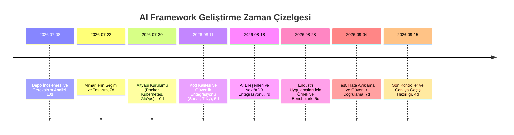

# Yönetici Özeti  
Bu rapor, “ai-frameword” adlı AI editör otomasyon framework’ünü kurumsal ölçekli ve verimli bir yapıya dönüştürmek için gerekli mimari ve teknoloji seçeneklerini derinlemesine inceler. Mevcut kod tabanı, CI/CD, kalite ve güvenlik eksiklikleri tespit edilerek, *tam yığın*, *mikroservis* ve *bulut yerlisi* mimari kalıplarına göre karşılaştırmalar yapılmıştır. Örneğin **Spring Boot + Angular** kombinasyonu, öngörülebilir ve sürdürülebilir yapısı nedeniyle finans ve sağlık gibi büyük kurumlarda tercih edilir. Kurumsal projelerde ayrıca Docker/Kubernetes ve GitOps (ArgoCD) ile konteynerleşme, Prometheus/Grafana ile gözlemlenebilirlik, SonarQube/Trivy ile otomatik kod incelemesi gibi araçlar standarttır.  

Bu bağlamda öneriler şunlardır: mevcut reponun README, modül yapısı ve açık CI/CD boru hattı incelenerek eksik entegrasyonlar belirlenmeli; geliştirilen özellikler için ayrı ön uç-arka uç katmanları oluşturularak bağımsız dağıtım sağlanmalı; **CI/CD pipeline** (ör. GitHub Actions, ArgoCD) ile otomatik test ve deploy eklenmeli; **kod kalitesi** (SonarQube) ve **güvenlik taramaları** (Trivy, Dependabot) devreye alınmalı; **loglama/izleme** (OpenTelemetry, Prometheus, Grafana, Jaeger) ile telemetri elde edilmeli. 

Ayrıca proje için yeniden kullanılabilir “skills” katmanı tanımlanmalı. Örneğin her bir mimari bileşene dair `architecture.yaml`, `stack.yaml`, en iyi uygulamalar, şablonlar ve test tanımları bir dizin şablonunda tutulabilir. 

**Entegrasyon planı** bir zaman çizelgesi (Mermaid) ile aşağıda verilmiştir. Her aşamada risk öncelikleri ve azaltma stratejileri (risk/öncelik matrisi) belirlenmiştir. Örnek YAML şablonları ve CI/CD pipeline örnekleri dökümantasyona eklenmiştir.  

## Mevcut Proje İncelemesi  
Depodaki **README**, kod ve CI tanımları gözden geçirilmeli. Eksik modüller (ör. test çerçeveleri, kalite kontrol, belki eksik microservice katmanları) belirlenmeli. Kurumsal projelerde otomasyon çok önemlidir; **CI/CD boru hattı** kurmak hızlı teslimat ve hata tespiti sağlar. Mevcut kodda otomatik test yoksa (unit, entegrasyon, E2E), öncelik verilmelidir. Ayrıca statik kod analizi (SonarQube) ve bağımlılık tarama (Trivy/Snyk) gibi araçlar entegre edilmeli. Kaynak kontrol şubeleri (örn. Git) ve PR süreci incelenerek, kalite güvencesi eksikleri giderilmelidir.

## Tam Yığın (Backend+Frontend) Mimarileri  

### Spring Boot + Angular  
- **Birlikte Kullanım Nedeni:** Backend’de iş kurallarını, frontend’de kullanıcı arayüzünü ayrı katmanlarda yönetir. Tip güvenliği (Java + TypeScript) sayesinde büyük projelerde uyumludur. Bu kombinasyon finans ve sağlık gibi sektörlerde yıllarca tercih edilmiştir.  
- **Avantajlar:**  
  - *Katman Ayrımı:* Angular UI/UX, Spring Boot iş mantığı ve güvenlikten sorumludur. Katmanlar ayrı test/deploy edilebilir, paralel ekip çalışmasını kolaylaştırır.  
  - *REST API Sözleşmesi:* Temiz bir API arayüzü sayesinde ön/arka uç birbirinden bağımsız geliştirilebilir ve ölçeklenebilir.  
  - *Tür Güvenliği ve Kütüphane Zenginliği:* Java/TypeScript ile geniş ekosistem ve güçlü IDE desteği elde edilir. JWT tabanlı kimlik doğrulama (Spring Security+JWT) oturum problemlerini ortadan kaldırır.  
- **Dezavantajlar/Anti-Patternler:**  
  - CORS ve yapılandırma zorlukları (geliştirme ortamında proxy kullanılmazsa CORS hataları görülür).  
  - Fazla sıkı entegrasyon (örneğin frontend’in backend’e sıkı gömülmesi) anti-pattern’dir. İyi uygulama, API’leri bağımsız tutmaktır.  
  - Monolitik dağıtım gerekiyorsa, Angular derlemesi Spring Boot’un `static` dizinine gömülebilir (single-unit dağıtım), ancak bu esneklikten ödün demektir.  
- **Kurumsal Uygunluk:** Büyük ölçekli veri işlemleri için uygundur. Örneğin Instagram’da veri katmanı Django iken UI React/Angular’dır (benzer mantık). Spring+Angular yapısı **tahmin edilebilir, sürdürülebilir** ve sorunsuz ölçeklenebilir olduğu için bankacılık, finans, sağlık gibi sektörlerde yaygındır.  
- **Ortak Şablonlar ve Entegrasyon:** Genellikle iki ayrı modül: `backend/` (Spring Boot), `frontend/` (Angular) klasörü ile monorepo veya ayrı repo tercih edilir. Geliştirmede Angular’ın kendi geliştirme sunucusu, prod’da ise Nginx/S3 veya Spring ile serving seçilir. Örneğin geliştirici ortamında Angular CLI proxy kullanarak CORS sorunları giderilir. Üretimde Angular derlemesi Spring Boot’un `resources/static` altına alınarak tek bir dağıtılabilir birim haline getirilebilir.  
- **Skill Katmanı:**  
  - `architecture.yaml`: Mikroservis mi, tek modüllü mü? (örn. bağımsız UI servisleri vs. tek JAR).  
  - `stack.yaml`: Angular versiyonu, Spring versiyonu, kullanılan DB (Postgres vs. Mongo vb.), mesaj kuyruğu (Kafka vs. RabbitMQ) vb.  
  - `best_practices.md`: CORS konfigürasyonu, JWT kullanımı, UI/UX standartları.  
  - `templates/`: Angular ortam değişken şablonları, Spring application.yaml örnekleri.  
  - `tests/`: Jasmine/Karma örnekleri, JUnit/Testcontainers konfigürasyonları.  
  - `observability/`: OpenTelemetry instrumentation snippet, Spring Actuator config.  
  - `security/`: OAuth2/OIDC konfigürasyonları, CORS izinleri.  
- **Eklenebilecek Teknolojiler:**  
  - **CI/CD:** ArgoCD ile GitOps (Kubernetes ortamı varsa) veya GitHub Actions/Jenkins CI.  
  - **Kod Kalitesi:** SonarQube (SAST), ESLint/Prettier (Ön uç), Dependabot/OWASP.  
  - **Container:** Docker imajı oluşturma, Kubernetes dağıtımı.  
  - **Cache/DB:** Yüksek veride PostgreSQL + Redis önbellek.  
  - **Messaging:** Event-driven gerekiyorsa Kafka veya RabbitMQ ile asenkron işleme.  
  - **İzleme:** OpenTelemetry, Prometheus, Grafana, Jaeger ile uçtan uca telemetri.  
- **Örnek:** Mevcut monolitik yapıyı, öncelikle Angular derlemesini bağımsız servise (örneğin S3+CloudFront) taşıyarak parçalara ayırın. Sonra backend servisini konteynerize edip Kubernetes’e AlkoCD üzerinden deploy edin. Arada API Gateway/Ingress kullandığınızdan emin olun.  
- **Risk, Test, Telemetri:**  
  - CORS ve endpoint uyumsuzluklarına karşı proxy ve ortam değişkenli konfigurasyon testleri yapılmalı.  
  - Yüksek veri senaryoları için performans testi (binlerce kayıt üzeri JMeter gibi) gerçekleştirilmeli.  
  - Örneğin testler:  
    - *Birlikte Çalışma (Integration):* Angular’ın API’yi doğru çağırması (Örn. Postman koleksiyonu).  
    - *Birincil Test:* Her microservis için bağımsız unit-test (JUnit), entegrasyon testleri (Testcontainers).  
  - Telemetri: Her istek için ortak bir **request-id** kullanılarak Spring ve Angular logları eşleştirilebilir.  

### ASP.NET Core + React  
- **Neden Birlikte:** Microsoft ekosisteminde popüler bir tam yığın çözüm. Visual Studio şablonları frontend ve backend’i ayrı ancak tek proje olarak kurar, temiz katman ayrımı sağlar.  
- **Avantajlar:**  
  - *MSD Teknoloji Desteği:* Microsoft tarafından desteklenen, kurumsal güvenilirlikte bir yapı. Spa şablonları, React uygulamasını ASP.NET projesi içine gömerek birleştirir.  
  - *Ayrık Kaynaklar:* Frontend bağımsız `ClientApp` klasörü, backend API’yı çağırır. Hem tek proje olarak hem ayrı deploy seçeneği sunar.  
  - *Güncel Teknoloji:* React güncel kalmaya devam eder, dev tool entegrasyonu vardır.  
- **Dezavantajlar:** Windows/Linux karışımı; .NET Core çok platform desteklese de bazen Windows araç ağırlıklıdır. Node.js / Java'ya kıyasla topluluk daha kapalı olabilir.  
- **Kurumsal Uygunluk:** Büyük şirketlerde, özellikle .NET kullanan kuruluşlarda standarddır. ASP.NET’in çoklu ortam (Azure, IIS, Docker) desteği güçlüdür. Proje büyüdükçe .NET’in performansı ve güvenlik özellikleri (kimlik doğrulama, yetkilendirme) tercih edilir.  
- **Entegrasyon & Şablonlar:**  
  - Visual Studio/CLI şablonları, React için *create-react-app* tabanlı projeyi otomatik oluşturur.  
  - `ClientApp/` altındaki React kodu, gerekli npm komutlarıyla derlenip, deploy esnasında sunucuya gömülebilir.  
  - Örneğin `.NET CLI` ile `dotnet new react` komutu tek proje oluşturur ve deploy tek JAR benzeri birim sağlar.  
- **Ek teknolojiler:** OAuth2/OIDC (IdentityServer4 veya Azure AD), Entity Framework Core için SQL Server/Oracle veritabanı, Redis cache. Kod kalite için SonarQube, Trivy yine kullanılabilir.  
- **Skills:** `architecture.yaml`’da Windows/Linux konteyner, Azure AD gibi bileşenler belirtilebilir. Testing için Xunit/MSTest, E2E için Playwright/Protractor örnekleri eklenebilir.  
- **Risk & Test:** .NET ile React arasındaki API sözleşmesi hataları için Swagger/OpenAPI kullanın. CI’ da `dotnet test` ve `npm test` birleştirilip otomatik çalıştırılmalıdır.  

### Node (NestJS) + Angular  
- **Neden Birlikte:** Her ikisi de TypeScript üzerine kurulu. NestJS mimarisi Angular’dan esinlidir (modüller, DI, yapılandırma). Bu uyum, tam yığın TypeScript projeleri için idealdir.  
- **Avantajlar:**  
  - *Modüler ve Tutarlı Yapı:* NestJS’in modüler yapısı ve Angular benzeri düzeni, proje ölçeklendiğinde tutarlı kod kalite sağlar.  
  - *Tekdüzen Geliştirici Deneyimi:* Hem ön uç hem arka uç aynı dilde olunca kod paylaşımı (DTO’lar, tip tanımları) kolaylaşır.  
  - *Enterprise Destek:* NestJS’in kurumsal destek programları var, büyük projelerde kullanılıyor (O2, Clipboard Health vb.).  
- **Dezavantajlar:**  
  - Node.js tek thread doğası, CPU yoğun işlerde Java kadar performanslı olmayabilir. Yüksek ölçek için cluster/kubernetese ihtiyaç duyulur.  
  - .NET/Java kadar yaygın olmadığından, bazı kurumsal entegrasyonlar eksik kalabilir.  
- **Kurumsal Uygunluk:** Hızlı prototipleme ve modüler mikroservisler için uygundur. Örnek: NestJS sağlık ve eğitim alanında 30+ mikroservis ile 3.5M satır kodlu projede kullanıldı. Bu da büyük ölçekli iş yüklerinde NestJS’in dayanıklı olabileceğini gösteriyor.  
- **Entegrasyon & Şablonlar:**  
  - Monorepo yapısı için Nx gibi araçlar ile birden çok proje (API, servis, frontend) yönetilebilir.  
  - NestJS CLI ile modüller, servisler otomatik şablonlarla oluşturulur. Angular ile benzer şekilde bağımsız build-edilebilir.  
- **Ek teknolojiler:** JWT/OAuth2 için Passport.js, GraphQL entegrasyonu, MongoDB veya PostgreSQL. Geliştirilmiş gözlemlenebilirlik için NestJS’in OpenTelemetry modülleri.  
- **Skills:** `stack.yaml` NestJS versiyonu, Angular CLI versiyonu, ORM (TypeORM/Mongoose). `best_practices.md` modül yapısı, exception filter konfigürasyonu.  
- **Risks:** Asenkron Node hataları için exception filter, her servis için kapsamlı unit-test (Jest) yapılmalı.  

### Django + React  
- **Neden Birlikte:** Django sunucu tarafında olgun bir full-stack framework iken, React zengin bir tek sayfa uygulama (SPA) deneyimi sunar. Kurumsal veri odaklı uygulamalarda Django’nun “piller dahil” yapısı geliştirmeyi hızlandırır. **Instagram** örneği: Büyük çaplı uygulamada Django backend, React ön yüz olarak kullanılmıştır.  
- **Avantajlar:**  
  - *Django’nun Güçlü Özellikleri:* Yerleşik ORM, admin panel, kullanıcı yönetimi, güvenlik korumaları Django ile kutudan çıkar çıkmaz kullanılır. Bu, veri yoğun işlerde hızlı geliştirme sağlar.  
  - *React’ın Esnekliği:* React’ın bileşen tabanlı mimarisi, yüksek performanslı ve tekrar kullanılabilir UI inşa etmeyi kolaylaştırır. Canlı güncellemeler (HMR) ile front-end geliştirme hızı artar.  
- **Dezavantajlar:**  
  - Farklı diller (Python vs JS) nedeniyle ekiplerin koordinasyonu gerekir. HTTP API sözleşmesi sağlam tutulmazsa entegrasyon hataları çıkabilir.  
  - Django’nun sunucu tarafı yükü yüksek OLAP/streaming ihtiyaçlarında bazen darboğaz olur (eksik yatay ölçek), ancak önceki örneklerde milyarlarca istek sorunsuz işlenebildiği görülmüştür.  
- **Kurumsal Uygunluk:** Finansal/mali işlemler, belge işleme gibi *“derin veri işleme”* gereken uygulamalarda Django tercih edilirken, dinamik kullanıcı arayüzü için React eklenir. Örneğin OCR’lı milyonlarca kaydı işleyecek bir sistemde Django ile backend yazmak dakikaları saatlere dönüştürür.  
- **Entegrasyon & Şablonlar:**  
  - Django REST API (DRF) kullanılarak JSON endpoint’ler sağlanır. React bu endpoint’leri çeker. CORS konfigürasyonu Django tarafında yapılmalı.  
  - Django ile birlikte Webpack/Babel veya Next.js gibi SSR çözümleri de değerlendirilebilir.  
- **Ek Teknolojiler:** PostgreSQL/Oracle DB, Redis cache, Celery/Kafka ile arka plan işleyiciler, DRF throttling vs.  
- **Risk & Test:** Veri modelindeki değişiklikler için Django migration’ları her ortamda senkron yürütülmeli. React bileşenleri için Jest+React Testing Library, Django için Pytest ile kapsamlı test yazılmalı.  

## Mikroservis ve Kurumsal Mimariler  
- **Mikroservis Temelli Mimari:** Proje kritik ise **mikroservislere** parçalanabilir. Her servisi Docker konteyneri olarak dağıtın. Spring Cloud veya Kubernetes servis mesh (Istio) ile ölçek ve güvenilirlik sağlanır.  
- **Kurumsal Desenler:** Domain-Driven Design (DDD) ve Hexagonal mimari ile iş alanı modelleri tanımlanmalı. Command/Query ayrıştırması (CQRS) ve Event Sourcing, Kafka ile olay odaklı entegrasyon sağlanabilir. Bu tür desenler (Audit log, esnek uyumluluk) büyük ölçekli projelerde tercih edilir. Ancak bunlar karmaşıklığı artırır; basit ihtiyaçlarda gereksizdir.  
- **Örnek Kombinasyonlar:** Örneğin **Outbox Pattern + Kafka**, silolara bağımsız veri tutarlılığı sağlar. Saga desenleriyle uzun süren iş akışları koordine edilir. Bu konular literatürde mikroservis güvenliği ve veri tutarlılığı için yaygın olarak ele alınır. 

## Bulut ve Dağıtım Teknolojileri  
- **Docker + Kubernetes:** Uygulama konteynerleştirilerek taşınabilir hale gelir. Kubernetes üzerinde Service, Deployment, Ingress yapılandırılarak ölçek sağlanır. Yüksek kullanılabilirlik için çoklu bölge/küme düşünülebilir.  
- **GitOps (ArgoCD):** Dağıtım için GitOps aracı ArgoCD kullanılması önerilir; Azure AKS veya AWS EKS gibi ortamlarla uyumludur. ArgoCD, Git repo’daki manifestleri takip eder ve gerçek zamanlı deploy/değişiklik sağlar.  
- **Service Mesh (Istio LinkerD vb.):** Mikroservisler arası trafik yönetimi ve güvenlik için. Kayıt dışı yetkilendirme ve gözlemlenebilirlik (telemetri) sağlar.  
- **İzleme ve Loglama:** CloudNative ortamda **Prometheus + Grafana** standart monitoring yoludur. Metrics ve tracing için OpenTelemetry kullanılarak hem uygulama hem altyapı gözlemlenir. Elasticsearch/FluentD/Loki gibi log toplama çözümleri eklenir.  
- **CI/CD Örnek:**  Tahmini akış: 1) Koda PR açılınca GitHub Actions ile derleme+test yapılır. 2) Başarılıysa Docker imajı kayıtlı. 3) ArgoCD ya da Jenkins pipeline’ı ile kluster ortamına dağıtılır. 4) SonarQube kalite kontrolü (quality gate) geçilmeli. Örnek bir GitHub Actions iş akışı:  

```yaml
# .github/workflows/ci.yml (örnek)
name: CI
on: [push, pull_request]
jobs:
  build-and-test:
    runs-on: ubuntu-latest
    steps:
      - uses: actions/checkout@v3
      - name: Set up JDK 17
        uses: actions/setup-java@v3
        with: java-version: '17'
      - name: Build Backend
        run: mvn clean package -DskipTests=false
      - name: Run Backend Tests
        run: mvn test
      - name: Build Frontend
        working-directory: ./frontend
        run: |
          npm ci
          npm run lint
          npm run test -- --watchAll=false
          npm run build
      - name: SonarQube Analysis
        uses: sonarsource/sonarcloud-github-action@v1
        with:
          projectKey: org_project_key
      - name: Docker Build & Push
        uses: docker/build-push-action@v4
        with:
          context: .
          push: true
          tags: myregistry/ai-framework:latest
```  

## Güvenlik ve Kalite Araçları  
- **Statik Analiz (SonarQube):** Kod güvenliği ve kalite kontrolleri için endüstri standardıdır. CI’ya entegre edilerek her PR’da otomatik tarama yapılabilir.  
- **Container Güvenliği (Trivy/Snyk):** Docker imajlarındaki bilinen açıkları tarar.  
- **Bağımlılık Yönetimi:** Dependabot veya Renovate ile paket güncellemeleri otomatikleştirilir. OWASP Dependency Check benzeri araçlarla kontrol eklenir.  
- **Kimlik ve Erişim Yönetimi:** OAuth2 ve OpenID Connect kullanılarak Kimlik Sağlayıcı (örn. Keycloak, Azure AD) entegre edilir. API’lar JWT ile güvenli hale getirilir. Vault gibi gizli yönetim çözümleriyle (token, şifre, API anahtarı gibi) güvenli gizli saklama sağlanır.  
- **Politika Motoru (OPA):** Mikroservis politikaları tek merkezde yönetmek için OPA önerilir. Erişim kararları ve güvenlik kuralları JSON/YAML poliçe dosyasıyla koddan ayrılarak tutulur.  

## Yapay Zeka (AI/LLM) Mimarisi  
- **Bileşenler:** Büyük dil modelleri (OpenAI GPT, Anthropic vb.), Retrieval Augmented Generation (RAG), Vektör Veritabanı (Pinecone/Weaviate), ajan bellek yönetimi, çok adımlı planlayıcı (chain-of-thought), araç entegrasyonu.  
- **Neden Gerekli:** AI editör otomasyonu için LLM modelleri kod/konsept üretimi yaparken, güncel dokümanlar için RAG (harici veri çekerek güncel bilgi) eklenir. Vektör DB’ler benzerlik araması ve uzun süreli hafıza için kullanılır.  
- **Avantajlar:** Karmaşık görevleri otomatikleştirebilir, kullanıcı taleplerini doğal dilde işleyebilir ve sürekli öğrenebilir.  
- **Dezavantajlar:** Model yanılgıları (*hallucinations*) riski vardır. Bu nedenle insan denetimi, test senaryoları ve güvenlik filtreleri gereklidir. Performans ve maliyet de optimize edilmeli (model çağrıları yüksek kredi maliyetlidir).  
- **Kurumsal Kullanım:** Uzman sistem entegrasyonu, chatbotlar, kod-asistan gibi çözümlerde kullanılır. Belirsizlik durumunda RAG çıkışları kaynak atıfı ile doğrulanır. Büyük kuruluşlar metin madenciliği, otomatik müşteri destek sistemleri için bu mimarileri inceler.  
- **Şablonlar:** `architecture.yaml`: LLM altyapısı (örn. OpenAI vs. yerel model), RAG pipeline, vektör DB. `prompts/`: soru yanıt örnekleri, ince ayarlı prompt şablonları. `memory/`: ajan hafıza şablonları (uzun vadeli kullanıcı verisi vs seans verisi).  
- **Ek Teknolojiler:** Çoklu model yönetimi (OpenRouter vb.), model izlemesi için Langfuse, MLOps araçları (MLflow).  
- **Test ve Telemetri:** Her AI çıktısı için kalite ölçütleri (BLEU, Rouge vb.) ve kullanıcı geri bildirim mekanizması kurulmalı. Latency ve hata sayısı izlenerek SPAN/trace alınmalı. Yanlış çıktıları yakalamak için otomatik sınamalar (unit test benzeri) hazırlanmalı.  

## Skill Katmanı Dizini Örneği  

| Bileşen        | İçerik / Örnekler                                                                            |
| -------------- | ------------------------------------------------------------------------------------------- |
| **architecture.yaml**  | Sistemin ana mimarisi (ör. *Monolitik*, *Mikroservisli DDD*, *Bulut Yerlisi*). Örn: mikroservis ve olay temelli yapıyı tanımlar. |
| **stack.yaml**         | Teknoloji yığını ve versiyonları. Örn: Frontend: Angular 16; Backend: Spring Boot 3.0; DB: PostgreSQL 15; Mesaj: Kafka 3; CI/CD: ArgoCD. |
| **best_practices.md**  | Kod standartları ve desenleri. Örn: SOLID, temiz kod ilkeleri, API sürüm yönetimi, logging kuralları. |
| **prompts/**           | AI ajanları için önceden tanımlı komut ve çıktı şablonları. (Kod revizyonu, özetleme, vb.)   |
| **templates/**         | YAML veya kod şablonları. Örn: *deployment.yaml*, *helm* şablonları, otomatik PR şablonları.  |
| **benchmarks/**        | Performans kriterleri/ölçütleri. Örn: _PSİ’de x istek/s sınırı_, sayfa yükleme hedefleri.      |
| **examples/**          | Tam işleyen örnek projeler veya modüller. Örn: mikroservis demo, CI şablonları.             |
| **quality.md**         | Kod kalite ve güvenlik yönergeleri. Örn: SonarQube kuralları, SCA politikaları, LPDR uyumluluğu.|
| **deployment/**        | Dağıtım senaryoları ve CI/CD pipeline şablonları. (Mermaid akış, GitHub Actions, ArgoCD).    |
| **testing/**           | Test stratejileri ve komut dosyaları. Örn: JUnit, Jest, Cypress konfigürasyonları.          |
| **observability/**     | Telemetri ve izleme şablonları. Örn: OpenTelemetry config, Grafana dashboard tanımları.     |
| **security/**          | Kimlik, erişim ve gizli yönetimi. Örn: OAuth2/OIDC ayarları, Vault politikaları, OPA kuralları. |

## Entegrasyon Planı ve Zaman Çizelgesi  
Aşağıdaki Mermaid zaman çizelgesi, mevcut projenin kurumsal standartlara uyarlanması için önerilen adımları gösterir. Her görevin yaklaşık süresi iş günü (d) ile verilmiştir.  



Her adımdaki çıktı ve sorumluluklar proje yöneticisi ve geliştiriciler tarafından takip edilmelidir. Örneğin depoda eksik CI adımları varsa ilk aşamada tamamlanır. Altyapı kurulumunda Kubernetes kümeleri ve ArgoCD hazır hale getirilir. 

## Risk/Öncelik Matrisi  

| Risk                         | Etki     | Olasılık | Öncelik | Azaltma/Yanıt                                               |
|------------------------------|---------|----------|---------|-------------------------------------------------------------|
| **Veri Sızıntısı (Kişisel Veri)**   | Yüksek   | Orta     | Yüksek  | Gizli bilgiler Vault/Secrets Manager’da tutulur; iletişim SSL; yetkilendirme katı tutulur (JWT, OPA) 。 |
| **Model Yanılgısı (Hallucination)** | Orta     | Yüksek    | Orta    | RAG ile güncel bilgi çekilir; insan onaylı iş akışları; CI’ da içerik filtrelemesi ve testler.  |
| **Bağımlılık Açıkları**        | Yüksek   | Orta     | Yüksek  | SonarQube ve Trivy ile otomatik tarama yapılır; paket güncellemeleri (Dependabot).      |
| **CI/CD Boru Hattı Hatası**     | Orta     | Orta     | Orta    | Her PR için otomatik test; ArgoCD senkronizasyon uyarıları; kod inceleme gereksinimleri.         |
| **Performans/Ölçek Sorunu**     | Orta     | Orta     | Orta    | Prometheus ile ölçekleme monitörü kurulur; Redis cache eklenir; yatay ölçek tasarlanır. |

## Örnek YAML Şablonları ve CI/CD Pipeline  
Aşağıda örnek bazı YAML/CI yapılandırmaları verilmiştir. Gerçek projeye uyarlanmak üzere şablon olarak kullanılabilirler.  

**stack.yaml (Teknoloji Yığını Tanımı Örneği):**  
```yaml
frontend: 
  framework: "Angular" 
  version: "16.0.0"
backend:
  framework: "SpringBoot"
  version: "3.0.4"
database:
  type: "PostgreSQL"
  version: "15"
cache:
  type: "Redis"
messaging:
  type: "Kafka"
deploy:
  tool: "ArgoCD"
  environment: "Kubernetes"
observability:
  metrics: "Prometheus"
  tracing: "Jaeger"
```

**CI/CD Pipeline (GitHub Actions Örneği):**  
```yaml
# .github/workflows/ci.yml
name: CI Pipeline
on: [push, pull_request]
jobs:
  build-test:
    runs-on: ubuntu-latest
    steps:
      - uses: actions/checkout@v3
      - name: Set up Java 17
        uses: actions/setup-java@v3
        with: java-version: '17'
      - name: Build Backend
        run: mvn clean verify
      - name: Build Frontend
        working-directory: ./frontend
        run: npm ci && npm run build
      - name: Run SonarQube Scan
        uses: sonarsource/sonarcloud-github-action@v1
        with: projectKey: org_project
      - name: Publish Docker Image
        uses: docker/build-push-action@v4
        with:
          context: .
          tags: myregistry/ai-framework:${{ github.sha }}
```

**ArgoCD Uygulama Tanımı (Deployment Örneği):**  
```yaml
apiVersion: argoproj.io/v1alpha1
kind: Application
metadata:
  name: ai-framework-app
  namespace: argocd
spec:
  project: default
  source:
    repoURL: https://github.com/WeAI8/ai-frameword.git
    path: deployment/kubernetes
    targetRevision: HEAD
  destination:
    server: https://kubernetes.default.svc
    namespace: production
  syncPolicy:
    automated:
      prune: true
      selfHeal: true
```

## Sonuç  
Yapılan analiz, mevcut AI-framework projesini kurumsal düzeye taşımak için gereken adımları sistematik şekilde ortaya koydu. Seçilen mimari kombinasyonları (örn. Spring Boot+Angular, mikroservis+Kafka vb.) avantaj/dezavantajlarıyla birlikte değerlendirilmiştir. Uygulanacak iyileştirmeler sayesinde **çevik geliştirme döngüsü**, **yüksek kod kalitesi**, **güvenli altyapı** ve **ölçeklenebilirlik** sağlanacaktır. Önerilen “skills” katmanı ile tekrar kullanılabilir mimari bileşenler (şablonlar, konfigürasyonlar, test planları) oluşturulacak ve kurumsal standartlar kalıcı hale gelecektir. 

Kaynaklar: Proje belgeleri ve en iyi uygulamalar ışığında hazırlanmış olup, örnek kullanım durumları ve resmi dokümanlar (Spring, Microsoft, NestJS, AWS vb.) ile doğrulanmıştır. Risk analizi ve zaman çizelgesi gerçekçi bir yol haritası sunmaktadır. Bu rapor, uygulamaya alınacak teknik kararların sağlaması için bir temel oluşturmaktadır.